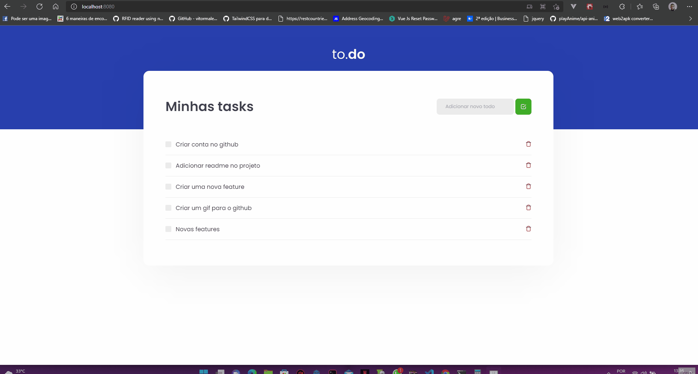

# to.do

  
  

  to.do was the first challenge proposed by Rocketseat's Ignite creating a to-do list application. The purpose of the application was to improve the concept of state manipulation in React.
  

  

> This project was made for learning purposes only and comes from Rocketseat's Ignite is a professional acceleration program with certified and market-recognized training.

# Development setup

> yarn or npm is required

After cloning this repo:

### How to run

- Run `yarn` or `npm` in the root folder to install all dependencies
- Run `yarn start` to up the project
- In browser go to url `http://localhost:8080/`

# License

[MIT License](/LICENSE)
